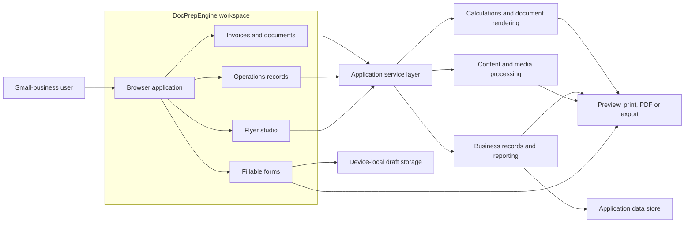

# DocPrepEngine — Project Case Study

> A sanitized portfolio case study. The production source code, client data, proprietary assets, credentials, and internal implementation details are intentionally not included.

## Project overview

DocPrepEngine is a browser-based workspace designed to help small businesses create professional documents and manage recurring administrative work without relying on disconnected spreadsheets, word-processing files, and paper forms.

The product brings four related workflows into one interface:

- **Invoices and documents:** Quotes, invoices, purchase orders, receipts, and other transaction documents with repeatable line items, automatic totals, document numbers, and print-ready output.
- **Fillable business forms:** Reusable browser templates for inventory counts, work orders, expense reimbursement, employee onboarding, incidents, complaints, returns, and opening or closing checklists.
- **Operations workspace:** Linked records for inventory and SKUs, sales, expenses, purchasing, customers, vendors, receivables, payables, cash flow, profit and loss, employees, timesheets, mileage, assets, tax planning, dashboards, and validation checks.
- **Flyer studio:** Editable, print-oriented promotional layouts with business details, products, pricing, images, themes, and export support.

All examples in this repository use fictional business information. No real customer, employee, vendor, financial, or client information is included.

## The problem

Small businesses often manage essential operations through a mixture of spreadsheets, document templates, handwritten forms, and one-off files. That approach creates several recurring problems:

- Information is entered more than once and becomes inconsistent.
- Calculations and document numbering are easy to get wrong.
- Staff members use different versions of the same form.
- Operational records are difficult to connect to useful summaries.
- Documents do not always look consistent when printed or shared.
- Important checks—such as overdue balances or low inventory—require manual review.

## The solution

DocPrepEngine converts these fragmented workflows into structured, browser-accessible tools. Users select a document or operational module, enter information through guided fields, review calculated values, and produce a clean printable result. Linked operational records support dashboards and checks so day-to-day entries can also provide a broader view of the business.

The design emphasizes practical use by nontechnical staff: familiar terminology, clear forms, editable rows, sensible defaults, responsive layouts, and print/PDF output.

## Key product decisions

1. **Browser-first workflows** make templates accessible without requiring desktop office software.
2. **Structured fields instead of free-form pages** improve consistency, validation, and reuse.
3. **Shared calculation rules** help the on-screen preview and exported document agree.
4. **Schema-driven operational modules** allow many record types to share a consistent editing experience.
5. **Print-aware layouts** preserve usability for businesses that still need physical paperwork or emailed PDFs.
6. **Fictional defaults** make demonstrations safer and prevent real business information from being embedded in templates.

## Individual responsibilities

My work on the project included:

- Translating spreadsheet, word-processing, and paper-based business workflows into browser experiences.
- Defining the information architecture for documents, printable forms, operations records, and promotional flyers.
- Building reusable, editable templates with repeating rows, calculated totals, document identifiers, and print behavior.
- Developing the browser interface with React and TypeScript.
- Implementing Python API services for document processing, calculations, records, and export workflows.
- Modeling linked operational data for reporting, dashboard summaries, and validation checks.
- Improving consistency between browser previews and printable or PDF output.
- Testing calculation rules, saved records, responsive behavior, and exported documents.
- Replacing real-world-looking defaults with clearly fictional demonstration data.

Before publishing this case study, the repository owner should confirm that this section matches their actual role and remove any responsibility they did not personally perform.

## Technologies used

| Area | Technologies |
| --- | --- |
| Front end | React, TypeScript, Vite, CSS, Tailwind CSS |
| Client communication | Axios, browser storage and print APIs |
| Back end | Python, FastAPI, Pydantic, Uvicorn |
| Data | SQLite, JSON and CSV workflows |
| Documents and media | PyMuPDF, pypdf, Pillow |
| Delivery | Docker and Render configuration |
| Quality | TypeScript production builds and Python automated tests |

The technology list describes the categories used in the project without publishing configuration, credentials, private endpoints, prompts, schemas, or source code.

## System overview

The diagram below is an independently created, high-level representation. It intentionally omits private implementation details.

More architectural context is available in [docs/system-overview.md](docs/system-overview.md).

## Outcome

The project demonstrates how a set of familiar office documents can become a connected small-business operations tool. Instead of treating an invoice, inventory sheet, expense log, and dashboard as unrelated files, DocPrepEngine gives them a consistent interaction model and creates a foundation for linked reporting.

The result is a workflow that can reduce duplicate entry, standardize routine paperwork, improve the quality of printed documents, and make operational information easier to review.

## What I learned

- Print workflows need to be designed and tested separately from responsive screen layouts.
- Repeating line items require careful handling of calculations, rounding, validation, and empty states.
- Flexible business software benefits from shared schemas, but each workflow still needs domain-specific labels and safeguards.
- Migrating familiar spreadsheets and forms works best when the browser experience preserves recognizable concepts while removing unnecessary manual work.
- Fictional demonstration data and a deliberate sanitization process are essential when presenting private client work publicly.
- A useful small-business tool must balance simplicity with enough structure to support reliable records and reporting.

## Why the source code is private

The production repository contains proprietary implementation work created for a private project. To protect intellectual property, contractual obligations, security-sensitive configuration, and the privacy of project stakeholders, the source code is not publicly available.

This repository exists only to explain the problem, product approach, architecture, responsibilities, technologies, and lessons learned. It is not a distributable version of the application and does not contain enough material to recreate the private system.

## Screenshots

Screenshots are intentionally excluded until the appropriate client or project owner has approved their public use. If approval is granted, only newly created screenshots containing fictional data should be added. See [screenshots/README.md](screenshots/README.md) for the sanitization requirements.

## Repository contents

- `README.md` — Sanitized project case study.
- `docs/system-overview.md` — Independently created, high-level system explanation.
- `screenshots/README.md` — Approval and sanitization requirements for future images.
- `PUBLISHING_CHECKLIST.md` — Final review steps before making the repository public.
- `NOTICE.md` — Scope and confidentiality notice.

## Important note

DocPrepEngine is a project name used for this case study. Any business names, people, products, identifiers, addresses, phone numbers, transactions, and financial values shown in future examples must be fictional.
