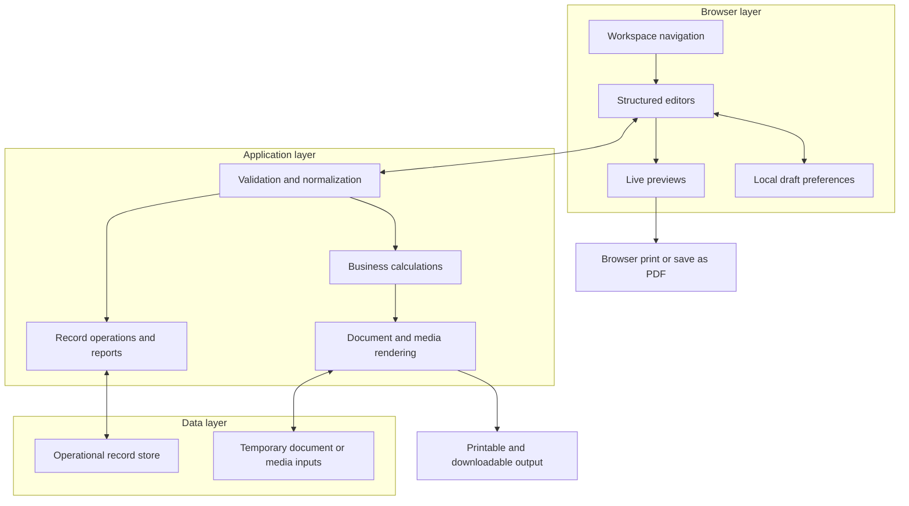

# Sanitized System Overview

This document describes DocPrepEngine at a conceptual level. It was created independently for the public case study and does not reproduce source code, private diagrams, database schemas, endpoints, prompts, credentials, infrastructure identifiers, or client documentation.

## Product surfaces

DocPrepEngine groups related small-business workflows into four surfaces:

1. **Business documents** collect party details, dates, terms, document identifiers, and repeating line items. Shared calculation rules produce totals for the preview and printable result.
2. **Fillable forms** present guided fields, checklists, and editable tables. Draft information can remain in the browser when server persistence is unnecessary.
3. **Operations records** organize common business data into linked modules and transform those records into summaries, reports, and validation checks.
4. **Flyer tools** combine editable content, images, pricing, and design choices into a print-oriented promotional document.

## High-level architecture

## Data-flow principles

- The user remains in control of what is entered, saved, printed, or exported.
- Inputs are normalized before calculations or reporting.
- Calculated fields use shared rules to reduce discrepancies between views.
- Operational summaries are derived from structured records rather than manually copied totals.
- Device-local drafts are appropriate only for nonshared convenience data.
- Employee, customer, vendor, financial, and tax records require access controls and retention policies in any production deployment.

## Design constraints

The product must work both as an interactive web application and as a source of polished printable documents. This creates constraints that ordinary web pages do not always face:

- Page dimensions and content overflow must be predictable.
- Dynamic rows must remain readable across page breaks.
- Colors, type, and spacing must survive print and PDF conversion.
- Calculations must not change between preview and output.
- Browser-local drafts must not be mistaken for shared or backed-up records.

## Deliberate omissions

This public overview does not document:

- Source code or code excerpts
- Database tables, migrations, or field-level schemas
- API paths or request/response contracts
- Prompts, model configuration, or provider credentials
- Hosting identifiers, environment values, or deployment secrets
- Client names, branding, assets, or production screenshots
- Real business records or analytics

These omissions preserve the value and confidentiality of the private implementation while still communicating the product and engineering approach.
